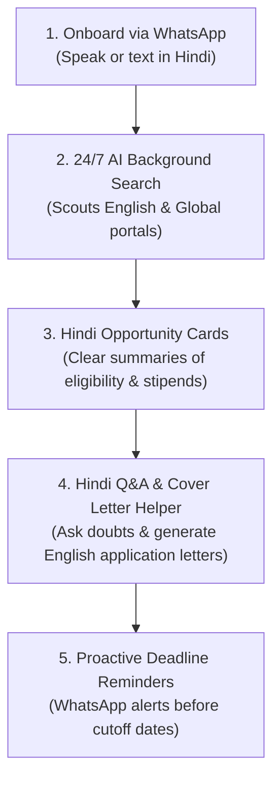

# AvsarVaani (अवसर वाणी)
### *Hindi-First AI Opportunity & Learning Copilot on WhatsApp*
*भाषा अब अवसर में बाधा नहीं — Breaking Language Barriers in Careers, Tech & Education for Hindi Speakers*

---

## Overview (विज़न और परिचय)

**AvsarVaani (अवसर वाणी — *Voice of Opportunity*)** is an AI-powered WhatsApp companion designed specifically for **Hindi-speaking students, job seekers, and ambitious learners**.

In India today, millions of Hindi speakers struggle to access top career opportunities, tech hackathons, internships, scholarships, and free learning resources. Over **90% of career portals and opportunity listings are published exclusively in complex English** across confusing websites. As a result, Hindi users waste endless hours manually searching multiple sites, navigating unfamiliar English interfaces, or missing out on life-changing opportunities altogether due to the language barrier.

**AvsarVaani solves this problem completely.**

Instead of spending hours searching complex English websites, users simply **talk or text to AvsarVaani on WhatsApp in Hindi** (using simple voice notes or text messages). AvsarVaani's intelligent agent continuously scouts global and local opportunity sources, translates and simplifies complex details into Hindi, and sends personalized opportunities, learning resources, and deadline reminders directly to the user on WhatsApp.

---

## The Core Problem & AvsarVaani's Solution (समस्या और समाधान)

| The Challenge for Hindi Speakers | The AvsarVaani Solution |
| :--- | :--- |
| **The English Barrier**: 90%+ of tech hackathons, internships & learning resources are published in English. | **Vernacular Translation & Simplification**: Discovers global listings and delivers easy-to-read Hindi summaries right on WhatsApp. |
| **Endless Manual Searching**: Wasting hours browsing dozens of fragmented portals every day. | **24/7 Autonomous Background Search**: Tell the agent what you want once in Hindi; it continuously searches for you in the background. |
| **Complex Desktop Sites**: Difficulty navigating complex English web interfaces on mobile devices. | **100% WhatsApp Native & Voice-First**: Onboard and search using simple Hindi voice notes or text messages on WhatsApp. |
| **Application Friction & Doubts**: Confusion over English eligibility rules & inability to draft formal application letters. | **Conversational Hindi Q&A & Application Helper**: Ask eligibility questions in Hindi & generate instant draft cover letters in English. |
| **Missed Deadlines**: Missing application windows due to lack of timely, accessible alerts. | **Automated WhatsApp Reminders**: Proactive countdown notifications delivered directly to your chat before cutoff dates. |

---

## Key Features for Hindi Users (प्रमुख विशेषताएँ)

### 1. Voice-First Onboarding in Hindi (हिंदी में वॉयस ऑनबोर्डिंग)
No need to fill out complex forms in English. Hindi users can record a voice note in Hindi explaining their goals, skills, and preferences (e.g. *"मैं बीएससी कंप्यूटर साइंस का छात्र हूँ और मुझे Python की फ्री इंटर्नशिप और कोर्स चाहिए"*). AvsarVaani understands spoken Hindi and builds a personalized candidate profile automatically.

### 2. 24/7 Continuous Opportunity Scouting (निरंतर ऑटोमैटिक खोज)
Set your preferences once, and AvsarVaani's AI agent works tirelessly in the background—scouting hackathon platforms, job portals, scholarship boards, and learning websites 24/7 to find updates matching your interests.

### 3. Vernacular AI Opportunity Cards (हिंदी अवसर कार्ड्स)
No more reading long English listings. Discovered opportunities are converted into clear, structured WhatsApp cards formatted in easy-to-read Hindi/bilingual text:
* **शीर्षक और क्षेत्र (Title & Category)**
* **अंतिम तिथि (Deadline Countdown)**
* **पात्रता मानदंड (Eligibility in simple Hindi)**
* **स्थान / वर्क फ्रॉम होम (Location / Work-from-Home status)**
* **स्टाइपेंड और पुरस्कार (Stipend & Rewards)**
* **डायरेक्ट आवेदन लिंक (Direct Application Link)**

### 4. Conversational Hindi Q&A & Application Drafter (हिंदी में सवाल-जवाब और आवेदन सहायता)
Have questions about a posting? Ask directly in Hindi on WhatsApp:
* *"क्या इसके लिए कोई फीस लगेगी?"* (Is there any registration fee?)
* *"क्या बिगिनर्स भी भाग ले सकते हैं?"* (Can beginners participate?)
* *"मेरे लिए एक कवर लेटर ड्राफ्ट कर दो"* (Draft a cover letter for me).

AvsarVaani provides clear answers in Hindi and can even write professional English application text for you to submit!

### 5. Drop Any Link or Poster Image to Translate & Track (लिंक या पोस्टर भेजो, तुरंत समझो)
Found an interesting poster or announcement in English on Instagram or Telegram? Simply forward the web link, image poster, or screenshot to AvsarVaani. The AI extracts the details, translates them into Hindi, and adds it to your tracking board.

### 6. Proactive Deadline Reminders (समय पर अलर्ट्स)
Never miss a cutoff date again. AvsarVaani tracks saved opportunities and pushes automated countdown notifications directly to your WhatsApp chat before applications close.

### 7. On-Demand Voice & Text Search (हिंदी में ऑन-डिमांड सर्च)
Initiate an instant search anytime in natural Hindi:
* *"इंदौर में डेटा साइंस की इंटर्नशिप ढूंढो"* (Find Data Science internships in Indore)
* *"हिंदी माध्यम के छात्रों के लिए स्कॉलरशिप बताओ"* (Tell me scholarships for Hindi medium students)
* *"वेब डेवलपमेंट के फ्री कोर्स खोजो"* (Find free Web Development courses)

### 8. No-Spam Daily Hindi Digest (दैनिक अवसर सार)
Avoid message clutter! AvsarVaani consolidates top matching opportunities into a single, high-relevance daily digest delivered at your preferred time.

---

## Built for the Hindi Club Hackathon (हिंदी क्लब हैकथॉन से जुड़ाव)

> **"भाषा अवसर में बाधा नहीं बननी चाहिए" — *Language should never be a barrier to opportunity.***

AvsarVaani addresses a crucial challenge in India's digital ecosystem:
1. **Bridging the Linguistic Divide**: Giving Hindi-speaking students equal access to global tech opportunities, hackathons, and career resources.
2. **Empowering Voice-First Users**: Harnessing speech recognition and AI translation to serve users who prefer speaking in Hindi over typing in English.
3. **Saving Time & Energy**: Eliminating hours of manual web searching so users can spend their time learning, upskilling, and succeeding.

---

## How It Works for a Hindi User (यह कैसे काम करता है)

### Step-by-Step Workflow:

1. **Onboard via WhatsApp (हिंदी में जुड़ें)**
   - Simply send a voice note or text message in Hindi stating what you want to learn or find (e.g. *"मुझे Python की इंटर्नशिप और वेब डेवलपमेंट के फ्री कोर्स चाहिए"*).

2. **24/7 AI Background Scouting (स्वचालित बैकग्राउंड खोज)**
   - The AI agent constantly searches English and global web portals, hackathon platforms, and job boards in the background.

3. **Vernacular Opportunity Cards (हिंदी अवसर कार्ड्स)**
   - Receive clean, structured WhatsApp cards with title, eligibility, stipend, deadline, and direct application link translated into easy Hindi.

4. **Hindi Q&A & Application Drafter (सवाल-जवाब व आवेदन सहायता)**
   - Ask any doubt in Hindi (*"क्या बिगिनर्स भाग ले सकते हैं?"*) and generate customized cover letters in English.

5. **Proactive WhatsApp Reminders (समय पर रिमाइंडर)**
   - Get automated deadline countdown alerts directly on WhatsApp so you never miss an application cutoff.

---

## Project Structure Overview

AvsarVaani is built with a modern, scalable architecture:

* **Frontend (`/Frontend`)**: Web-based user onboarding and phone verification interface built with React & Vite.
* **Backend (`/Backend`)**: High-performance FastAPI backend processing WhatsApp webhooks, Hindi speech-to-text, AI translation, intent routing, and automated scouting tasks.
* **Documentation (`/docs`)**: Additional guides for developers and contributors.

---

## Developer Documentation

For technical contributors and local environment setup:
* **[Developer Setup Guide](docs/developer_docs.md)**
* **[Core Features Guide](docs/features.md)**

---

## License

This project is licensed under the [MIT License](LICENSE).
