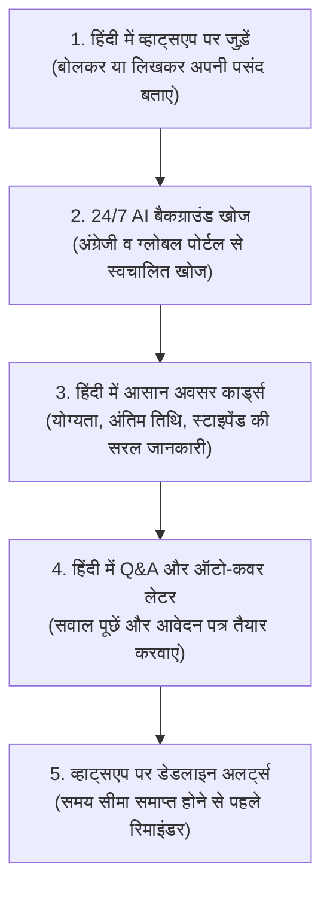

# अवसर वाणी (AvsarVaani)
### *व्हाट्सएप पर हिंदी-प्रथम AI अवसर और शिक्षा गाइड*
*भाषा अब अवसर में बाधा नहीं — हिंदी भाषियों के लिए करियर, तकनीक और शिक्षा में भाषा की दीवारों को तोड़ना*

---

## अवलोकन (Overview)

**अवसर वाणी (AvsarVaani)** एक AI-संचालित व्हाट्सएप साथी है, जिसे विशेष रूप से **हिंदी भाषी छात्रों, नौकरी की तलाश करने वालों और महत्वाकांक्षी शिक्षार्थियों** के लिए बनाया गया है।

आज भारत में, लाखों हिंदी भाषी छात्र शीर्ष करियर अवसरों, टेक हैकथॉन, इंटर्नशिप, छात्रवृत्ति (Scholarships) और मुफ्त सीखने के संसाधनों तक पहुँचने के लिए संघर्ष करते हैं। इंटरनेट पर **90% से अधिक करियर पोर्टल और अवसरों की सूची जटिल अंग्रेजी में** कठिन वेबसाइटों पर प्रकाशित होती है। इसके परिणामस्वरूप, हिंदी उपयोगकर्ताओं को कई वेबसाइटों को खोजने, अपरिचित अंग्रेजी इंटरफेस को समझने में घंटों बर्बाद करने पड़ते हैं, या भाषा की बाधा के कारण वे जीवन बदलने वाले अवसरों से पूरी तरह चूक जाते हैं।

**अवसर वाणी इस समस्या का समाधान करती है।**

जटिल अंग्रेजी वेबसाइटों को खोजने में घंटों बिताने के बजाय, उपयोगकर्ता बस **व्हाट्सएप पर हिंदी में (वॉयस मैसेज या टेक्स्ट द्वारा) अवसर वाणी से बात कर सकते हैं।** अवसर वाणी का बुद्धिमानी भरा AI एजेंट लगातार राष्ट्रीय और वैश्विक स्रोतों से अवसरों की खोज करता है, जटिल जानकारी का हिंदी में अनुवाद और सरलीकरण करता है, और सीधे आपके व्हाट्सएप पर व्यक्तिगत अवसर, अध्ययन सामग्री और अंतिम तिथि के रिमाइंडर भेजता है।

---

## मुख्य समस्या और अवसर वाणी का समाधान (Problem & Solution)

| हिंदी भाषियों के लिए चुनौती | अवसर वाणी का समाधान |
| :--- | :--- |
| **अंग्रेजी की दीवार**: 90%+ टेक हैकथॉन, इंटर्नशिप और सीखने के संसाधन केवल अंग्रेजी में हैं। | **सरल हिंदी अनुवाद**: वैश्विक सूचियों की खोज करता है और सीधे व्हाट्सएप पर आसान हिंदी सारांश प्रदान करता है। |
| **घंटों की मैनुअल खोज**: हर दिन दर्जनों वेबसाइटों को खोजने में कीमती समय बर्बाद होना। | **24/7 ऑटोमैटिक बैकग्राउंड खोज**: एक बार हिंदी में अपनी पसंद बताएं; AI बैकग्राउंड में लगातार खोज करता रहता है। |
| **जटिल वेबसाइट इंटरफेस**: मोबाइल पर कठिन अंग्रेजी वेबसाइटों और फॉर्म को समझने में परेशानी। | **100% व्हाट्सएप और वॉयस-फर्स्ट**: व्हाट्सएप पर सरल हिंदी वॉयस नोट या टेक्स्ट संदेशों द्वारा उपयोग करें। |
| **आवेदन में संकोच व भ्रम**: अंग्रेजी नियमों को न समझ पाना और आवेदन पत्र तैयार न कर पाना। | **हिंदी Q&A और आवेदन सहायक**: हिंदी में सवाल पूछें (*"क्या मैं पात्र हूँ?"*) और अंग्रेजी में कवर लेटर तैयार करवाएं। |
| **अंतिम तिथि निकल जाना**: समय पर जानकारी न मिलने के कारण आवेदन की समय सीमा समाप्त होना। | **व्हाट्सएप पर ऑटोमैटिक रिमाइंडर**: अंतिम तिथि समाप्त होने से पहले सीधे आपके व्हाट्सएप पर अलर्ट। |

---

## मुख्य विशेषताएँ (Key Features)

### 1. हिंदी में वॉयस-फर्स्ट ऑनबोर्डिंग (Voice-First Onboarding)
अंग्रेजी में जटिल फॉर्म भरने की कोई आवश्यकता नहीं है। हिंदी भाषी उपयोगकर्ता आसानी से हिंदी में एक वॉयस नोट रिकॉर्ड कर सकते हैं (जैसे: *"मैं बीएससी कंप्यूटर साइंस का छात्र हूँ और मुझे Python की फ्री इंटर्नशिप और कोर्स चाहिए"*)। अवसर वाणी बोली जाने वाली हिंदी को समझती है और ऑटोमैटिक आपकी प्रोफाइल तैयार करती है।

### 2. 24/7 निरंतर ऑटोमैटिक खोज (Continuous AI Scouting)
अपनी रुचि एक बार सेट करें, और अवसर वाणी का AI एजेंट बैकग्राउंड में 24/7 काम करता है—हैकथॉन प्लेटफॉर्म, जॉब पोर्टल, स्कॉलरशिप बोर्ड और लर्निंग वेबसाइट्स से आपके लिए नए अवसर ढूंढता है।

### 3. हिंदी अवसर कार्ड्स (Vernacular AI Cards)
अब लंबी अंग्रेजी सूचियां पढ़ने की जरूरत नहीं है। खोजे गए अवसरों को स्पष्ट, संरचित व्हाट्सएप कार्ड्स में परिवर्तित किया जाता है:
* **शीर्षक और क्षेत्र** (Title & Category)
* **अंतिम तिथि और काउंटडाउन** (Deadline)
* **पात्रता मानदंड** (Simple Eligibility)
* **स्थान / वर्क फ्रॉम होम** (Location / WFH)
* **स्टाइपेंड और पुरस्कार** (Stipend & Rewards)
* **डायरेक्ट आवेदन लिंक** (Direct Link)

### 4. हिंदी में सवाल-जवाब और कवर लेटर सहायक (Hindi Q&A & Support)
किसी अवसर के बारे में कोई संदेह है? सीधे हिंदी में व्हाट्सएप पर पूछें:
* *"क्या इसके लिए कोई फीस लगेगी?"*
* *"क्या बिगिनर्स भी भाग ले सकते हैं?"*
* *"मेरे लिए एक कवर लेटर ड्राफ्ट कर दो"*

अवसर वाणी हिंदी में स्पष्ट उत्तर देती है और जमा करने के लिए अंग्रेजी में पेशेवर कवर लेटर भी तैयार कर सकती है!

### 5. पोस्टर या लिंक भेजें, तुरंत समझें (Forward-to-Track)
इंस्टाग्राम या टेलीग्राम पर अंग्रेजी में कोई पोस्टर या लिंक मिला? बस उस लिंक, फोटो या स्क्रीनशॉट को अवसर वाणी को व्हाट्सएप पर भेजें। AI विवरण निकालता है, हिंदी में अनुवाद करता है, और आपके ट्रैकिंग बोर्ड में जोड़ देता है।

### 6. अंतिम तिथि के अलर्ट्स (Proactive Reminders)
फिर कभी आवेदन की तारीख न चूकें। अवसर वाणी आपके सेव किए गए अवसरों को ट्रैक करती है और आवेदन बंद होने से पहले सीधे आपके व्हाट्सएप पर अलर्ट भेजती है।

### 7. हिंदी में ऑन-डिमांड खोज (On-Demand Search)
अपनी भाषा में कभी भी त्वरित खोज शुरू करें:
* *"भोपाल में डेटा साइंस की इंटर्नशिप ढूंढो"*
* *"हिंदी माध्यम के छात्रों के लिए स्कॉलरशिप बताओ"*
* *"वेब डेवलपमेंट के फ्री कोर्स खोजो"*

### 8. दैनिक अवसर सार (No-Spam Daily Digest)
अत्यधिक संदेशों से बचें! अवसर वाणी दिन के टॉप 3-5 सबसे प्रासंगिक अवसरों को एक सुंदर दैनिक डाइजेस्ट में समेकित करके आपके पसंदीदा समय पर भेजती है।

---

## हिंदी क्लब हैकथॉन के लिए विशेष (Built for Hindi Club Hackathon)

> **"भाषा अवसर में बाधा नहीं बननी चाहिए" — *Language should never be a barrier to opportunity.***

अवसर वाणी भारत के डिजिटल पारिस्थितिकी तंत्र में एक महत्वपूर्ण चुनौती का समाधान करती है:
1. **भाषाई असमानता को दूर करना**: हिंदी भाषी छात्रों को वैश्विक तकनीकी अवसरों, हैकथॉन और करियर संसाधनों तक समान पहुँच प्रदान करना।
2. **वॉयस-फर्स्ट उपयोगकर्ताओं का सशक्तिकरण**: उन उपयोगकर्ताओं की सहायता के लिए स्पीच-टू-टेक्स्ट और AI अनुवाद का उपयोग करना जो अंग्रेजी में टाइप करने के बजाय हिंदी में बोलना पसंद करते हैं।
3. **समय की बचत**: घंटों की मैनुअल खोज को समाप्त करना ताकि उपयोगकर्ता अपना समय सीखने और कौशल विकास में लगा सकें।

---

## यह एक हिंदी उपयोगकर्ता के लिए कैसे काम करता है? (How It Works)

### चरण-दर-चरण प्रक्रिया (Step-by-Step Workflow):

1. **हिंदी में व्हाट्सएप पर जुड़ें**
   - व्हाट्सएप पर एक वॉयस नोट या टेक्स्ट संदेश भेजें (जैसे: *"मैं कंप्यूटर साइंस का छात्र हूँ और मुझे Python की फ्री इंटर्नशिप और कोर्स चाहिए"*)।

2. **24/7 AI बैकग्राउंड खोज**
   - AI एजेंट बैकग्राउंड में अंग्रेजी और वैश्विक वेब पोर्टल, हैकथॉन प्लेटफॉर्म और जॉब बोर्ड्स से अवसरों की निरंतर खोज करता है।

3. **हिंदी अवसर कार्ड्स**
   - शीर्षक, पात्रता, स्टाइपेंड, अंतिम तिथि और डायरेक्ट आवेदन लिंक के साथ आसान हिंदी में संरचित व्हाट्सएप कार्ड प्राप्त करें।

4. **हिंदी Q&A और आवेदन सहायता**
   - हिंदी में सवाल पूछें (*"क्या इसके लिए कोई फीस लगेगी?"*) और अंग्रेजी में आवेदन पत्र तैयार करवाएं।

5. **व्हाट्सएप पर डेडलाइन अलर्ट्स**
   - अंतिम तिथि समाप्त होने से पहले व्हाट्सएप पर ऑटोमैटिक रिमाइंडर प्राप्त करें।

---

## प्रोजेक्ट संरचना का अवलोकन (Project Architecture)

* **Frontend (`/Frontend`)**: उपयोगकर्ताओं के पंजीकरण और फोन सत्यापन के लिए वेब इंटरफेस (React & Vite)।
* **Backend (`/Backend`)**: व्हाट्सएप संचार, हिंदी स्पीच-टू-टेक्स्ट, AI अनुवाद और बैकग्राउंड सर्च के लिए FastAPI सर्वर।
* **Documentation (`/docs`)**: डेवलपर्स और योगदानकर्ताओं के लिए विस्तृत गाइड।

---

## डेवलपर दस्तावेज़ (Developer Documentation)

तकनीकी सेटअप और स्थानीय रूप से चलाने के निर्देशों के लिए:
* **[डेवलपर सेटअप गाइड](docs/developer_docs.md)**
* **[विशेषताओं की विस्तृत सूची](docs/features.md)**

---

## लाइसेंस

यह प्रोजेक्ट [MIT लाइसेंस](LICENSE) के तहत उपलब्ध है।
